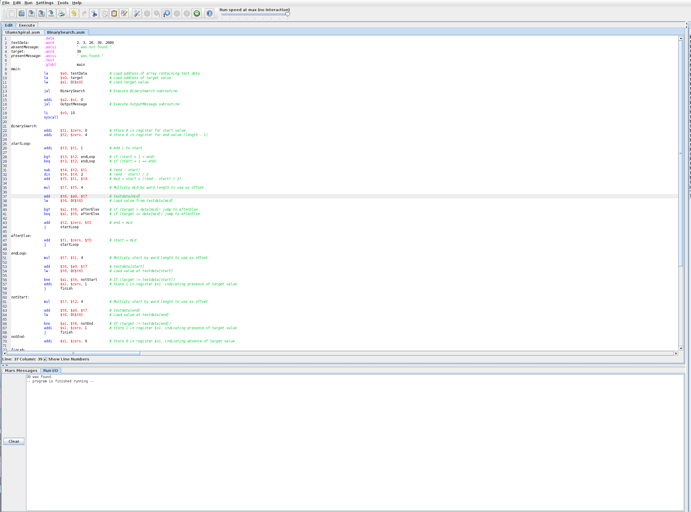

# MIPS32 Binary Search

### Instructions:

* open program with [Mars](http://courses.missouristate.edu/KenVollmar/mars/download.htm)
* input ordered list of integers to store in testData array
* input target integer
* assemble the file
* run the program
* observe output to detect presence or absence of target integer
